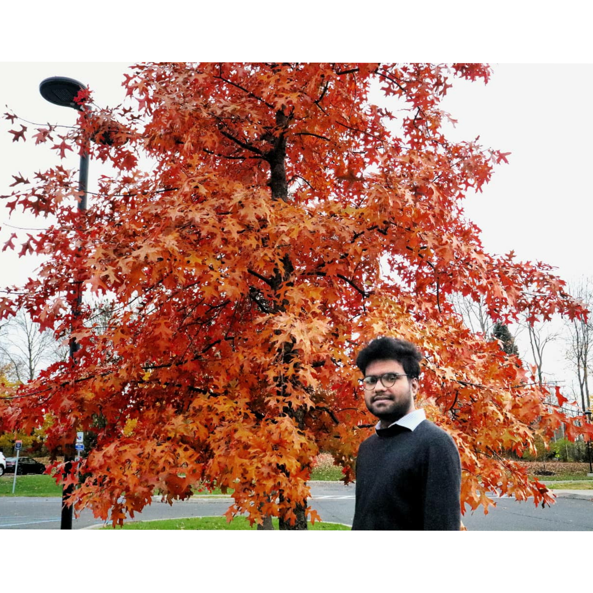

<<<<<<< HEAD
# About

## Surya Narayanan Murugaiyan Ragupathy

- Address : 20 Colonial Drive, APt C, New Paltz - 12561.
- Email : narayans4@newpaltz.edu
- Github : surya-narayanan0503

Hi Professor, myself Surya Narayanan Murugaiyan Ragupathy from Tamil Nadu, India. I did my bachelor's in Computer Science Engineering in India (2019). Even after completing my under-graduation, my thirst to gain in-depth knowledge of computer science remains unquenched. Hence, I had worked and gained experience in EMIS Health Care as a Software Associate in an Extracts Project. I did my final year project GPS-based bus route tracking system using the language Core Java during my undergrad. I did my mini-project "Beat in a Teeth" which bought me many accolades including Dr.Kalam Young Achiever Award presented by World youth Foundation (WYF) during my bachelor's.

# Course Objective

Immediately, upon completing this course, "Advanced Web Server Program", I aspire to become an expert in full-stack development that will help me to achieve a software developer role in a reputed company. In the long time run, I wish to be an entrepreneur starting my own web development company that develops websites and e-products and contributes to society in their daily chores.
=======
# This repo will hold my work in Home
## Graduate Level Advanced Web Programming - Fall 2021

- HTML
- CSS
- Bulma
- Vue 3
- NodeJS
- Express
- CI/CD
>>>>>>> 323094aedfa1ad524dc8b0e21e692bd847923d6e
